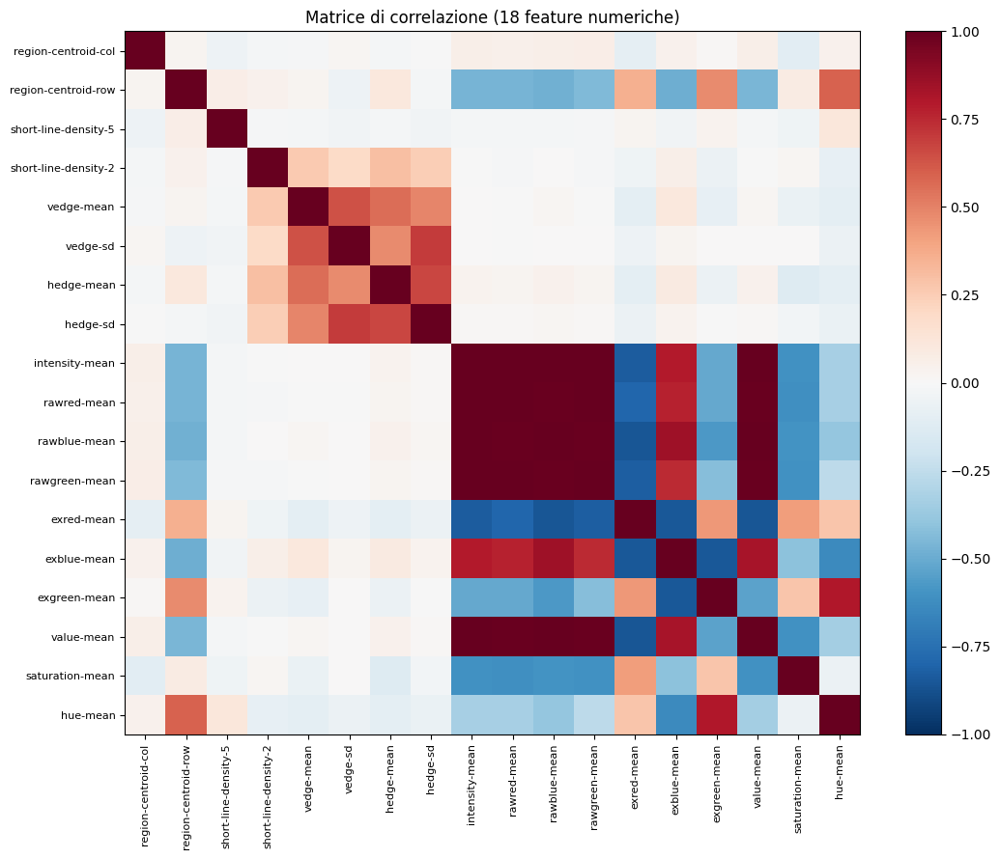
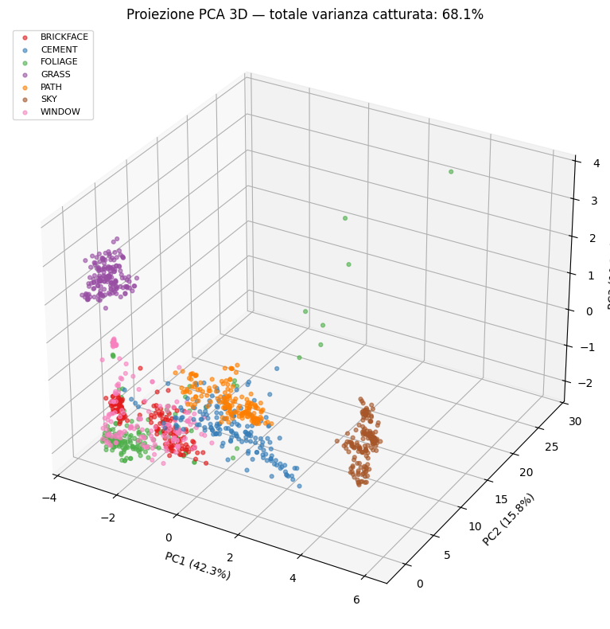
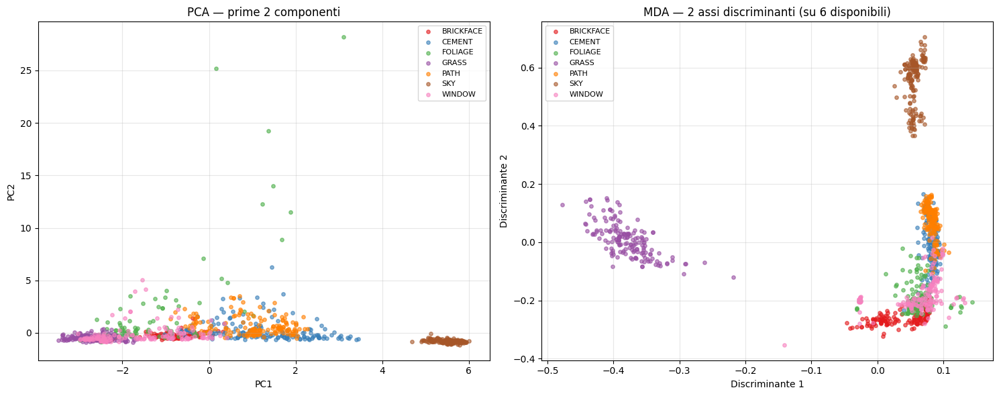
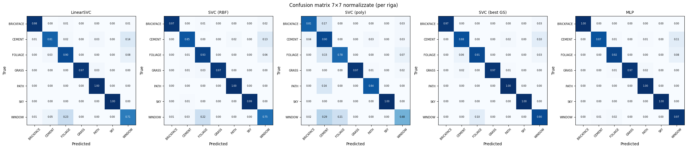

# Statlog (Image Segmentation) — Classificazione supervisionata

Progetto di **Matematica per l'Intelligenza Artificiale**
Politecnico di Torino · Corso di Laurea in Matematica per l'Ingegneria
Autrice: **Angelamaria Colucci** (s323606)

> **TL;DR** — Pipeline completa di machine learning sul dataset *Statlog Image Segmentation* (UCI #147): dall'analisi esplorativa alla riduzione di dimensionalità (PCA, FDA/MDA) fino a sei classificatori (LDA, QDA, SVM lineare/RBF/polinomiale, MLP). Il **Multi‑Layer Perceptron** raggiunge **96.3% di accuracy** sul test set, primo tra i modelli confrontati.

---

## Il problema

Il dataset contiene **2310 regioni 3×3 pixel** estratte da immagini outdoor, ognuna descritta da **19 feature numeriche** (posizione, colore RGB, texture dei bordi, saturazione). L'obiettivo è classificare ogni regione in una delle **7 classi** perfettamente bilanciate: `BRICKFACE`, `CEMENT`, `FOLIAGE`, `GRASS`, `PATH`, `SKY`, `WINDOW`.

È un benchmark classico di *low-level image understanding*, ideale per confrontare metodi lineari e non lineari su dati tabulari strutturati.



## Pipeline

Il progetto applica l'intera metodologia del corso in modo incrementale, motivando ogni passaggio con evidenza empirica:

1. **EDA** — analisi di distribuzioni, correlazioni e scale; rimozione di una feature costante; individuazione di quattro pattern distributivi (posizione, texture, colore RGB, eccessi di colore).
2. **Preparazione** — encoding del target, split train/validation/test, standardizzazione (z-score) motivata da una disparità di scale di ~5 ordini di grandezza.
3. **PCA** — riduzione di dimensionalità, scree plot, interpretazione dei loadings e errore di ricostruzione.
4. **FDA / MDA** — analisi discriminante multiclasse, confronto supervisionato vs non supervisionato.
5. **LDA & QDA** — classificatori bayesiani e compromesso bias-varianza.
6. **SVM** — kernel lineare, RBF e polinomiale, con grid search e k-fold cross validation.
7. **MLP** — rete neurale a 2 hidden layer con early stopping.
8. **Confronto finale** — matrici di confusione 7×7 e analisi per classe.

## Risultati principali

| Modello | Accuracy (test) | Note |
|---|---|---|
| SVC polinomiale (default) | 0.828 | La flessibilità senza tuning è dannosa |
| LinearSVC | 0.910 | Baseline lineare |
| SVC RBF (default) | 0.923 | Beneficio modesto del kernel non lineare |
| **SVC RBF (grid search)** | **0.947** | Config. ottimale `C=100`, `γ=0.01` |
| **MLP (128, 64)** | **0.963** | Migliore modello, early stopping a 74 epoche |

Sul sotto-problema binario `CEMENT` vs `WINDOW`, **LDA** (0.926) generalizza meglio di **QDA** (0.875): con pochi esempi per classe, la QDA stimando due matrici di covarianza separate soffre di overfitting.

### Perché vince l'MLP

Il vantaggio dell'MLP (~1.6 punti sul miglior SVM) si concentra sulle classi urbane difficili (`FOLIAGE`, `CEMENT`, `WINDOW`), dove la rappresentazione gerarchica intra-blocco / inter-blocco delle feature sfrutta la struttura semantica naturale del dataset (colore, texture, posizione).

<table>
<tr>
<td></td>
<td></td>
</tr>
<tr>
<td align="center"><em>Proiezione PCA 3D (68% varianza)</em></td>
<td align="center"><em>PCA vs MDA: l'approccio supervisionato isola più classi</em></td>
</tr>
</table>



## Contenuto del repository

```
├── AngelamariaColucci.ipynb    # Notebook completo (EDA → modelli → conclusioni)
├── FisherDA.py                 # Implementazione Fisher Discriminant Analysis
├── segment.dat / segment.doc   # Dataset originale UCI e descrizione ufficiale
├── statlog_imseg.csv           # Dataset in formato CSV
├── images/                     # Grafici principali usati nel README
├── requirements.txt
└── README.md
```

## Come eseguire

```bash
git clone <url-del-repo>
cd statlog-image-segmentation
pip install -r requirements.txt
jupyter notebook AngelamariaColucci.ipynb
```

## Stack tecnico

Python · NumPy · pandas · scikit-learn · matplotlib · Jupyter

## Dataset

Statlog (Image Segmentation), UCI Machine Learning Repository #147 — Vision Group, University of Massachusetts (novembre 1990).
<https://archive.ics.uci.edu/dataset/147/statlog+image+segmentation>
